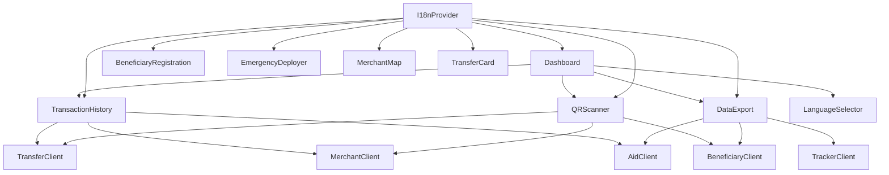

# Design Document: UI Feature Enhancements

## Overview

This document covers the technical design for four UI enhancements to the Stellar Disaster Relief Payments platform: transaction history viewing, QR code scanning and generation, multi-language (i18n) support, and data export. All four features are implemented as React + TypeScript + Tailwind CSS components that integrate with the existing SDK clients.

The existing component pattern uses functional components with hooks, receives SDK client instances as props, and manages async state with `loading`/`error` local state. The new components follow this same pattern.

---

## Architecture



### Key Design Decisions

- **i18n via React Context**: A single `I18nProvider` wraps the app root. Components consume translations via a `useTranslation` hook — no prop drilling.
- **QR scanning via jsQR**: `jsQR` is a pure-JS library (no native bindings) that decodes QR codes from raw pixel data. It is loaded via a dynamic `import()` to keep the initial bundle lean. The `qrcode` package already in `package.json` handles generation.
- **Export as pure client-side serialization**: No server round-trip. The export logic serializes in-memory data and triggers a download via a Blob URL.
- **TransactionHistory as a controlled component**: The parent (Dashboard) passes the entity type and ID; the component owns its own fetch, filter, and display state.

---

## Components and Interfaces

### TransactionHistory

```typescript
type EntityType = 'transfer' | 'merchant' | 'fund';

interface TransactionHistoryProps {
  entityType: EntityType;
  entityId: string;
  transferClient: TransferClient;
  merchantClient: MerchantClient;
  aidClient: AidClient;
}

// Unified display record — normalizes TransferTransaction, Transaction, DisbursementRecord
interface TransactionRow {
  id: string;
  amount: string;
  timestamp: number;
  status: string;          // derived: "completed" | "pending" | "failed"
  senderId: string;
  recipientId: string;
  raw: TransferTransaction | Transaction | DisbursementRecord;
}

interface FilterState {
  startDate: string;       // ISO date string, empty = no filter
  endDate: string;
  status: string;          // empty = all
}
```

Internal state: `rows: TransactionRow[]`, `filtered: TransactionRow[]`, `loading: boolean`, `error: string | null`, `filters: FilterState`.

Filtering is applied client-side on the already-fetched `rows` array whenever `filters` changes — no re-fetch needed.

### QRScanner

```typescript
type QREntityType = 'beneficiary' | 'transfer' | 'merchant';
type QRMode = 'scan' | 'generate';

interface QRScannerProps {
  beneficiaryClient: BeneficiaryClient;
  transferClient: TransferClient;
  merchantClient: MerchantClient;
  // Entity IDs needed for generation
  entityId?: string;
  entityData?: BeneficiaryProfile | ConditionalTransfer | Merchant;
}

interface ScanResult {
  entityType: QREntityType;
  isValid: boolean;
  entity: BeneficiaryProfile | ConditionalTransfer | Merchant | null;
  errorMessage: string | null;
}
```

Internal state: `mode: QRMode`, `entityType: QREntityType`, `scanning: boolean`, `cameraError: string | null`, `scanResult: ScanResult | null`, `generatedQR: string | null` (data URL).

The component uses a `<video>` element + `<canvas>` for camera capture. A `requestAnimationFrame` loop extracts pixel data and passes it to `jsQR`. On decode, the raw string is routed to the correct SDK validation method based on `entityType`.

### i18n System

```typescript
// Locale file shape (e.g., en.json)
interface LocaleMessages {
  [key: string]: string | LocaleMessages;  // supports nested keys
}

interface I18nContextValue {
  locale: string;                          // "en" | "fr" | "ar"
  t: (key: string, vars?: Record<string, string>) => string;
  setLocale: (locale: string) => void;
  dir: 'ltr' | 'rtl';
  supportedLocales: string[];
}

interface LanguageSelectorProps {
  // no required props — reads/writes via context
}
```

`useTranslation()` returns `{ t, locale, dir }` from context.

### DataExport

```typescript
type ExportEntityType = 'beneficiaries' | 'funds';
type ExportFormat = 'csv' | 'json';

interface DataExportProps {
  beneficiaryClient: BeneficiaryClient;
  aidClient: AidClient;
  trackerClient: TrackerClient;
  // Optional pre-filter context
  disasterId?: string;
  fundId?: string;
}

interface ExportOptions {
  entityType: ExportEntityType;
  format: ExportFormat;
  startDate: string;
  endDate: string;
}
```

Internal state: `options: ExportOptions`, `loading: boolean`, `warning: string | null`.

---

## Data Models

### Normalized TransactionRow

The three SDK methods return different types. `TransactionRow` normalizes them for uniform rendering:

| Source | `id` | `amount` | `timestamp` | `status` | `senderId` | `recipientId` |
|---|---|---|---|---|---|---|
| `TransferTransaction` | `.id` | `.amount` | `.timestamp` | `.isApproved ? "completed" : "failed"` | `transfer.creator` | `.merchantId` |
| `Transaction` | `.id` | `.amount` | `.timestamp` | `.isSettled ? "completed" : "pending"` | `.beneficiaryId` | `.merchantId` |
| `DisbursementRecord` | `.id` | `.amount` | `.timestamp` | `"completed"` | `.approvedBy[0]` | `.beneficiary` |

### i18n Locale File Structure

```
ui/src/i18n/
  locales/
    en.json
    fr.json
    ar.json
  I18nContext.tsx      ← context + provider
  useTranslation.ts    ← hook
  index.ts             ← re-exports
```

Locale file example (`en.json`):
```json
{
  "nav": {
    "dashboard": "Dashboard",
    "language": "Language"
  },
  "transactions": {
    "title": "Transaction History",
    "loading": "Loading transactions...",
    "empty": "No transactions found",
    "filter": {
      "status": "Filter by status",
      "dateRange": "Date range"
    }
  },
  "qr": {
    "scan": "Scan QR Code",
    "generate": "Generate QR Code",
    "cameraError": "Camera access denied. Please enable camera permissions.",
    "selectType": "Select entity type"
  },
  "export": {
    "title": "Export Data",
    "format": "Format",
    "download": "Download",
    "empty": "No records match the selected filters."
  }
}
```

Translation keys use dot-notation: `t('transactions.title')`.

### Export Serialization

**CSV**: Column headers are derived from the TypeScript type field names, converted to Title Case (e.g., `walletAddress` → `Wallet Address`). Values are comma-separated with string fields quoted. A header row is always included.

**JSON**: A `JSON.stringify(records, null, 2)` of the filtered array, conforming to the source TypeScript type.

**Filename pattern**: `{entity-type}-export-{YYYY-MM-DD}.{ext}` — e.g., `beneficiaries-export-2024-01-15.csv`.

Download is triggered by creating a `Blob`, generating an object URL, clicking a hidden `<a>` element, then revoking the URL.

---

## Correctness Properties


*A property is a characteristic or behavior that should hold true across all valid executions of a system — essentially, a formal statement about what the system should do. Properties serve as the bridge between human-readable specifications and machine-verifiable correctness guarantees.*

### Property 1: Transaction normalization completeness

*For any* valid `TransferTransaction`, `Transaction`, or `DisbursementRecord`, the normalization function that converts it to a `TransactionRow` should produce a row where `id`, `amount`, `timestamp`, `status`, `senderId`, and `recipientId` are all non-empty strings.

**Validates: Requirements 1.1, 1.3**

### Property 2: Date range filter correctness

*For any* list of `TransactionRow` records and any date range `[start, end]`, applying the date filter should return only records whose `timestamp` falls within `[start, end]` (inclusive), and no records outside that range should appear.

**Validates: Requirements 1.7**

### Property 3: Status filter correctness

*For any* list of `TransactionRow` records and any status string, applying the status filter should return only records whose `status` equals the filter value, and no records with a different status should appear.

**Validates: Requirements 1.8**

### Property 4: QR validation routing

*For any* decoded QR string and selected entity type (`beneficiary`, `transfer`, or `merchant`), the scanner's dispatch logic should invoke exactly the corresponding SDK validation method (`validateBeneficiaryQRCode`, `validateTransferQRCode`, or `validateMerchantQRCode`) and no other.

**Validates: Requirements 2.2, 2.3, 2.4, 2.7**

### Property 5: QR generation routing

*For any* entity type and entity data, the generation dispatch logic should invoke exactly the corresponding SDK generation method (`generateBeneficiaryQRCode`, `generateTransferQRCode`, or `generateMerchantQRCode`) and return a non-empty string.

**Validates: Requirements 2.9**

### Property 6: Locale switch updates translations

*For any* supported locale `L` and any translation key `k` that exists in locale `L`'s file, after calling `setLocale(L)`, `t(k)` should return the string from locale `L`'s file, not from any other locale.

**Validates: Requirements 3.3**

### Property 7: Locale persistence round-trip

*For any* supported locale `L`, after calling `setLocale(L)`, reading `localStorage.getItem('locale')` should return `L`.

**Validates: Requirements 3.4**

### Property 8: Default locale resolution

*For any* `navigator.language` value, the resolved initial locale should be the supported locale whose prefix matches, or `"en"` if no supported locale matches.

**Validates: Requirements 3.5**

### Property 9: RTL direction for Arabic only

*For any* supported locale, `dir` should equal `"rtl"` if and only if the locale is `"ar"`.

**Validates: Requirements 3.6**

### Property 10: Translation key coverage

*For any* translation key `k` used in a `t()` call across all components, `k` should exist in every supported locale file (or fall back to English per Property 11).

**Validates: Requirements 3.7**

### Property 11: Missing key fallback to English

*For any* translation key `k` that exists in `en.json` but is absent from locale `L`'s file, `t(k)` when locale is `L` should return the English string for `k`, not an empty string or the key itself.

**Validates: Requirements 3.8**

### Property 12: Dynamic locale discovery

*For any* locale file added to the `locales/` directory, `supportedLocales` should include that locale's identifier without any code changes outside the locale file.

**Validates: Requirements 3.10**

### Property 13: Serialization row count invariant

*For any* non-empty array of `BeneficiaryProfile`, `EmergencyFund`, or `DisbursementRecord` objects, both the CSV serializer and the JSON serializer should produce output representing exactly the same number of records as the input array.

**Validates: Requirements 4.1, 4.2**

### Property 14: CSV header row

*For any* non-empty array of typed export objects, the CSV output's first line should contain human-readable column names (one per field), and the total number of lines should equal `1 + records.length`.

**Validates: Requirements 4.5**

### Property 15: JSON export round-trip

*For any* array of typed export objects, `JSON.parse(toJSON(objects))` should produce an array of the same length where each element has the same field values as the corresponding input object.

**Validates: Requirements 4.6**

### Property 16: Export filename pattern

*For any* entity type string `e`, format string `f` (`csv` or `json`), and date `d`, the generated filename should match the regex `^{e}-export-\d{4}-\d{2}-\d{2}\.{f}$`.

**Validates: Requirements 4.4**

### Property 17: Export date filter correctness

*For any* array of records with timestamps and any date range `[start, end]`, the export date filter should return only records whose timestamp falls within `[start, end]`, and no records outside that range.

**Validates: Requirements 4.7**

---

## Error Handling

### TransactionHistory

- Fetch errors: caught in try/catch, stored in `error` state, rendered as an inline error banner with a "Retry" button that re-invokes the fetch.
- Empty results: distinguished from errors — renders a dedicated empty-state message.
- Invalid entity type: TypeScript exhaustive check at compile time; runtime guard logs a warning and renders empty state.

### QRScanner

- Camera permission denied (`NotAllowedError`): caught from `getUserMedia`, sets `cameraError` with guidance text.
- Camera not found (`NotFoundError`): caught from `getUserMedia`, sets `cameraError` with device-not-found message.
- QR decode failure (no QR found in frame): silent — the scan loop continues until a code is found or the user cancels.
- SDK validation failure (returns `false` or throws): sets `scanResult.isValid = false` with the error message.
- jsQR dynamic import failure: caught, falls back to a message asking the user to refresh.

### i18n System

- Missing translation key: `t()` checks the active locale first, then falls back to `en`, then returns the key string itself as a last resort (never crashes).
- Invalid locale passed to `setLocale()`: ignored if not in `supportedLocales`; current locale is unchanged.
- localStorage unavailable (private browsing): wrapped in try/catch; locale still works in-memory for the session.

### DataExport

- Fetch errors during export: caught, displayed as an inline error message; export button re-enabled.
- Empty filtered dataset: detected before serialization; warning message shown, no download triggered.
- Blob/URL API unavailable: caught, falls back to a `data:` URI approach.

---

## Testing Strategy

### Dual Testing Approach

Both unit tests and property-based tests are required. They are complementary:

- **Unit tests** cover specific examples, integration points, loading/error/empty UI states, and edge cases.
- **Property-based tests** verify universal correctness across all valid inputs for the 17 properties above.

### Unit Test Coverage

Key unit test scenarios (not exhaustive):

- `TransactionHistory` renders loading spinner when `loading=true`
- `TransactionHistory` renders error banner + retry button when fetch fails
- `TransactionHistory` renders empty-state message when result is `[]`
- `QRScanner` renders camera error message when `getUserMedia` rejects with `NotAllowedError`
- `QRScanner` renders entity details after successful scan + validation
- `QRScanner` renders generated QR image after generation
- `I18nProvider` initializes to `"en"` when `localStorage` is empty and `navigator.language` is unsupported
- `LanguageSelector` renders a selector element with at least 3 options
- `DataExport` renders warning and does not trigger download when filtered dataset is empty
- `DataExport` renders loading indicator and disabled button during export

### Property-Based Testing

**Library**: [`fast-check`](https://github.com/dubzzz/fast-check) — a mature TypeScript-native property-based testing library.

**Configuration**: Each property test runs a minimum of **100 iterations**.

**Tag format**: Each test is tagged with a comment:
```
// Feature: ui-feature-enhancements, Property {N}: {property_text}
```

Each of the 17 correctness properties above maps to exactly one property-based test. Example structure:

```typescript
// Feature: ui-feature-enhancements, Property 2: Date range filter correctness
it('date range filter returns only records within range', () => {
  fc.assert(
    fc.property(
      fc.array(arbitraryTransactionRow()),
      fc.tuple(fc.date(), fc.date()).map(([a, b]) => [
        Math.min(a.getTime(), b.getTime()),
        Math.max(a.getTime(), b.getTime()),
      ]),
      (rows, [start, end]) => {
        const result = applyDateFilter(rows, start, end);
        return result.every(r => r.timestamp >= start && r.timestamp <= end);
      }
    ),
    { numRuns: 100 }
  );
});
```

Arbitraries needed:
- `arbitraryTransactionRow()` — generates random `TransactionRow` with valid fields
- `arbitraryBeneficiaryProfile()` — generates random `BeneficiaryProfile`
- `arbitraryEmergencyFund()` — generates random `EmergencyFund`
- `arbitraryDisbursementRecord()` — generates random `DisbursementRecord`
- `arbitraryLocale()` — picks from `["en", "fr", "ar"]`
- `arbitraryTranslationKey()` — picks from the known key set

### Dashboard Integration

`Dashboard` renders `TransactionHistory`, `QRScanner`, and `DataExport` as tab panels or modal overlays. It passes the appropriate SDK client instances as props. `LanguageSelector` is rendered in the header area and reads/writes locale via `I18nContext`. The `I18nProvider` wraps the entire app at the root level (e.g., in `App.tsx`), so all components have access to translations without prop drilling.
